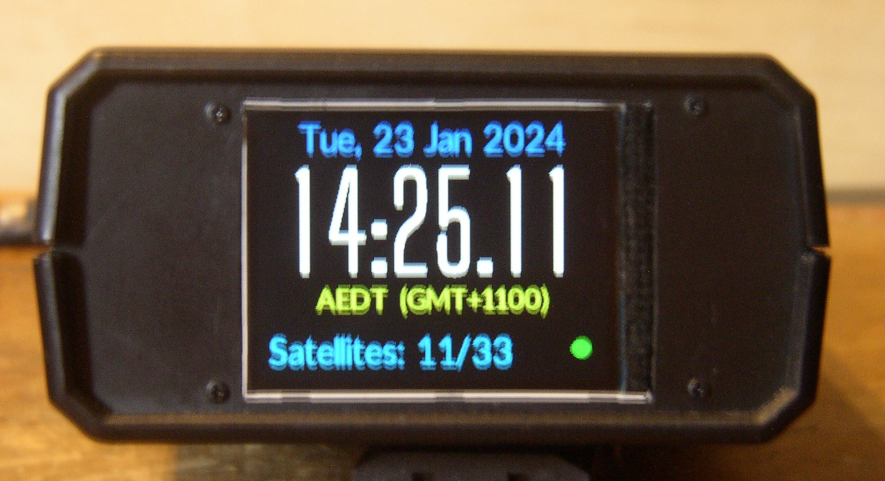
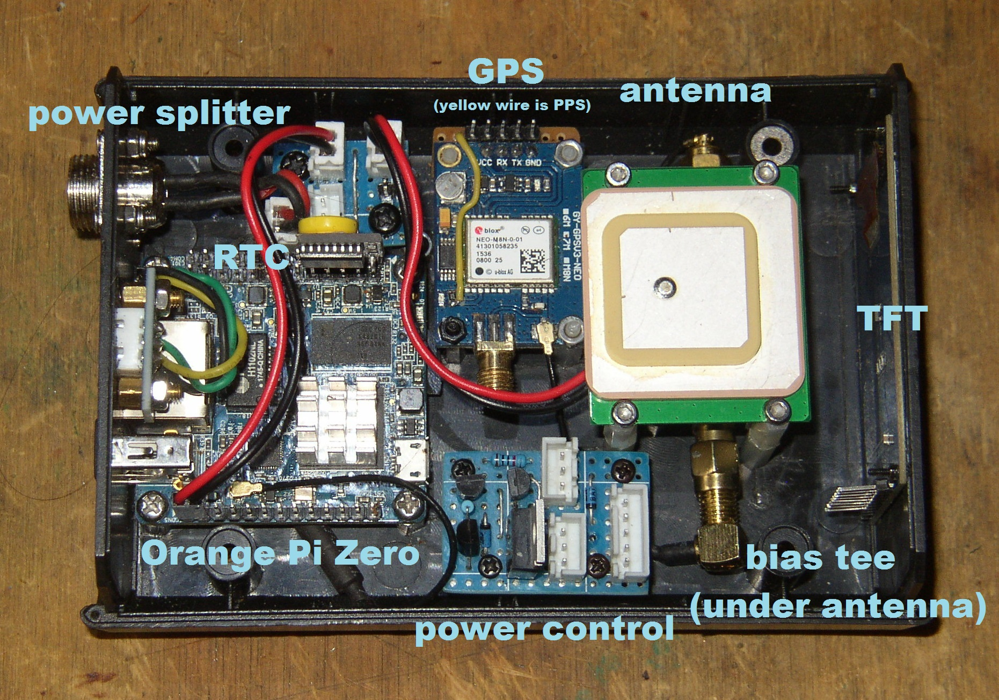
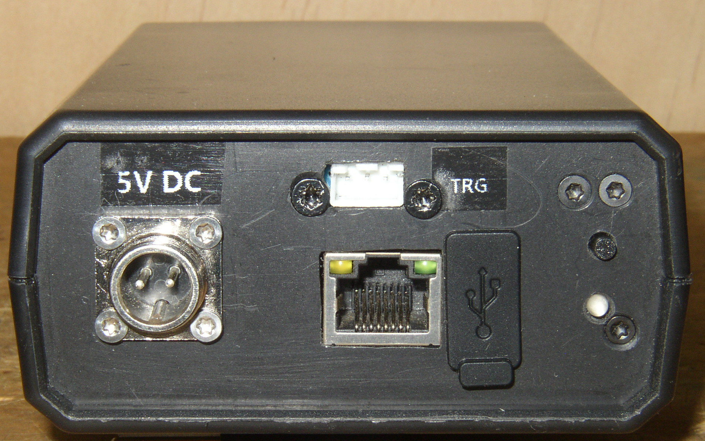
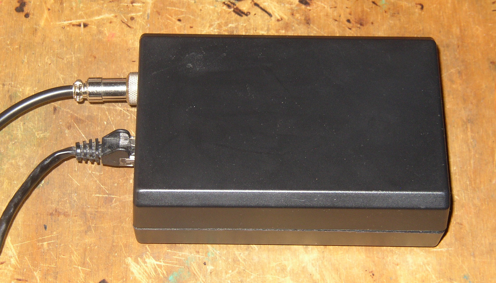
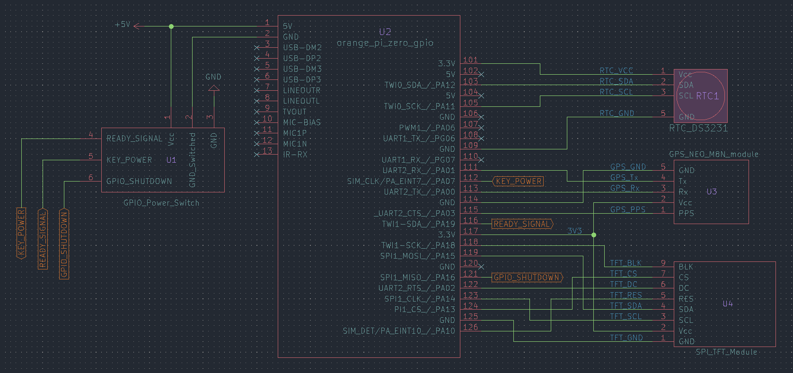
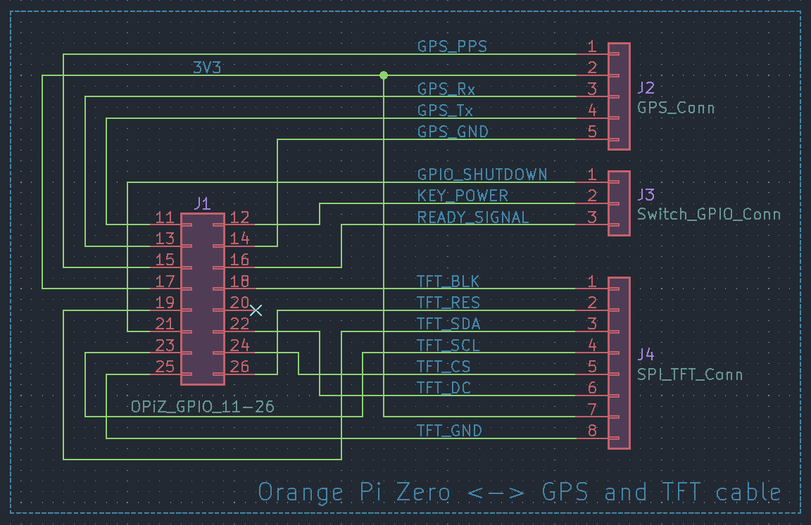

# Orange Pi Zero GPS NTP Server
An Orange Pi Zero with attached GPS, TFT and RTC devices, to create a stratum 1
NTP server.

<p><a href="images/enclosed-front.jpg">
  
</a><br/>
<em>Orange Pi Zero GPS NTP Server</em></p>

[moonbuggy/fbgpsclock][moonbuggy/fbgpsclock] is used to interface between the
display and the other devices.

*   [Hardware](#hardware)
    +   [Assembled](#assembled)
    +   [Components](#components)
        -   [Orange Pi Zero](#orange-pi-zero)
        -   [GPS (NEO-M8N)](#gps-neo-m8n)
        -   [TFT display (ST7789V driver)](#tft-display-st7789v-driver)
        -   [Real-time Clock (DS3231)](#real-time-clock-ds3231)
        -   [Power Switch](#power-switch)
    +   [Wiring](#wiring)
        -   [Schematic](#schematic)
        -   [Cable](#cable)
        -   [Power Splitter](#power-splitter)
*   [Software](#software)
    +   [Pre-built OS Image](#pre-built-os-image)
    +   [Manual Configuration](#manual-configuration)
        -   [Armbian](#armbian)
        -   [Status LED](#status-led)
        -   [gpsd](#gpsd)
        -   [chrony](#chrony)
        -   [fbgpsclock](#fbgpsclock)
*   [Links](#links)

## Hardware
### Assembled
<p><a href="images/internals-with-cable.jpg">
  
</a><br/>
<em>internals</em></p>

<p><a href="images/internals-without-cable-annotated.jpg">
  
</a><br/>
<em>internals (annotated)</em></p>

<p><a href="images/enclosed-front-top.jpg">
  
</a><br/>
<em>top</em></p>

<p><a href="images/enclosed-rear.jpg">
  
</a><br/>
<em>rear</em></p>

<p><a href="images/enclosed-side.jpg">
  
</a><br/>
<em>side</em></p>

There's also [a gallery __(NSFW)__](https://imgur.com/a/yd1e8r0) with some
images from various stages of testing and building.

### Components
#### Orange Pi Zero
Although we're using an Orange Pi Zero (OPiZ) here, the specific single-board
computer used isn't all that important. Any device with UART, SPI, I2C and GPIO
interfaces should work, needing only one of each.

Any device tree overlays in this repository will, however, be specifically for
the OPiZ and would need to be modified for use on other SBCs.

#### GPS (NEO-M8N)
We're using a u-blox NEO-M8N GPS, although any GPS device that _gpsd_ can talk
to should work.

<p><a href="images/module-NEO-M8N.jpg">
  
</a><br/>
<em>u-blox NEO-M8N module</em></p>

Soldering a wire to a point between the PPS LED and its current limiting
resistor provides a usable PPS signal on this module.

The GPS is attached through a UART interface (_UART2_), while the
PPS signal is connected separately through a GPIO pin (_pin 15_, _PA03_).

##### Bias tee
A bias tee is installed between the GPS module and the antenna. This allows us
to run the antenna's internal low-noise amplifier (LNA) off the 5V enclosure
supply, rather than the 3.3V that would be provided via the GPS module.Running
the LNA at a higher power should give us better signal.

##### Antenna
There's a lot of antenna options available, it really depends on the use case

A standard panel antenna seems to be more than adequate indoors, inside a
plastic enclosure with the rest of the hardware. Ideally the panel antenna
should have mounting holes so it can be screwed securely to the enclosure,
rather than being taped/glued to a circuit board as may be necessary with
antenna included with the GPS module.

#### TFT display (ST7789V driver)
An LCD screen attached to the OPiZ's SPI bus gives us a way to display
the current time and any other information that may be relevant.

<p><a href="images/module-2.0-SPI-TFT.jpg">
  
</a><br/>
<em>2.0" SPI TFT</em></p>

A TFT with an ST7789V driver chip and 240x320 pixel resolution has been used in
this case, but a working device tree overlay for a 240x280 pixel display has
also been provided. Other resolutions will work with some minor modifications to
the DT overlay. Using a different driver chip is more complicated.

The exact dimensions of the display don't matter a great deal, it's really only
limited by how much surface area is available on the enclosure to fit a screen.

The TFT display is attached to the SPI1 bus.

#### Real-time Clock (DS3231)
A real-time clock provides accurate time immediately after booting. This is
useful because, coming from a cold start, the GPS module can take a little while
to establish a fix and begin providing time data. Covering this gap with an RTC
means we always have access to a time reference.

The DS3231 is a good option for a cheap and easy I2C RTC module.

<p><a href="images/module-DS3231.jpg">
  
</a><br/>
<em>DS3231 RTC module</em></p>

#### Power Switch
A power switch from [moonbuggy/GPIO-power-switch][moonbuggy/GPIO-power-switch]
lets us properly shutdown and cut power to the whole enclosure (including the GPS
module and bias tee).

Making use of the remaining free pins in the cable, we can use the following:

|    signal     | pin | GPIO |
|:-------------:|:---:|:----:|
| GPIO_POWEROFF | 21  | PA16 |
| KEY_POWER     | 12  | PA07 |
| READY_SIGNAL  | 16  | PA19 |

> [!NOTE]
> The _GPIO_SHUTDOWN_ signal requires `CONFIG_POWER_RESET_GPIO` and
> `CONFIG_POWER_RESET_GPIO_RESTART` to be enabled in the kernel, which may not
> be the case for a default OS install.

Due to pin 16 (_PA19_) having an internal pull-up resistor, we'll use the verson
of the power switch with the active low LED so the default LED state at power
up is _not-ready_.

More details are available at [moonbuggy/GPIO-power-switch][moonbuggy/GPIO-power-switch].

### Wiring
#### Schematic
<p><a href="images/schematic-gpio.png">
  
</a><br/>
<em>GPIO wiring</em></p>

#### Cable
The specific pins chosen allow us to make a convenient cable to connect the GPS,
TFT and power control modules while leaving the I2C pins clear for the RTC
module to plug directly in.

<p><a href="images/schematic-cable-2.0inch.png">
  
</a><br/>
<em>GPS + 2.0" TFT + power control cable schematic</em></p>

> [!NOTE]
> The cable is wired for the specific attached devices. The OPiZ end is static,
> but the other connectors will need to be adjusted to match the pinout of the
> particular TFT and GPS modules in use.

Most of the connectors are standard pin sockets, with a 2x8 socket being used
for the OPiZ end 1x5 and 1x8 sockets on the GPS and TFT modules respectively.
A JST XH2.54 connector is used for the GPIO signals to/from the power control
board.

<p><a href="images/cable-GPS-TFT-power.jpg">
  
</a><br/>
<em>GPS + TFT + power control cable</em></p>

The OPiZ end of the cable will attach to GPIO pins 11 to 26. Using a
black wire for the ground connection to OPiZ pin 25 provides a convenient way to
align the connector, regardless of the other wire colours.

#### Power Splitter
<p><a href="images/schematic-splitter.png">
  
</a><br/>
<em>power splitter</em></p>

In an ideal world there'd be enough room in the enclosure to combine this
splitter and the power control circuit on a single PCB, to save a cable run
(although it's not a big deal that they're separate).

Closing the jumper bypasses the switch in the power control circuit, directly
connecting the OPiZ and bias tee to ground, and is useful during testing. The
button and LED in the power control circuit will still work as expected, and
the MOSFET will still switch, it just won't have any effect and actually cut
power after a <code>shutdown -h</code> command or button press.

## Software
### Pre-built OS Image
There's a pre-built Armbian image in the
[releases](https://github.com/moonbuggy/Orange-Pi-Zero-GPS-NTP/releases/latest)
which will work out of the box for a build using the same (or compatible)
hardware wired as described above. All the setup and configuration steps below
have been done during the image creation.

Simply write the _*.img.xz_ file to an SD card, put the card in the OPiZ, power
it up.

GPS devices other than the Neo M8N should work easily with this image, so long
as they use _uart2_ (and use _pin 15_/_PA03_ for the PPS signal). A different
display controller or RTC, however, would be incompatible with the device tree
in the image.

It's possible to re-configure the pre-built OS after first boot, if necessary
to adjust for differing hardware. Depending on how much modification is needed,
it may be easier to start with a bare OS and do the manual steps described
below.

#### Packages
The _*.deb_ files in the release are packages which can be installed on top of
an existing Armbian install, as an alternative to the pre-built image.

These packages just add the modules necessary for the GPIO power switch to work
to the kernel. They do not install any GPS/NTP/TFT software or handle any of the
configuration like the image does.

Install with: <code>sudo dpkg -i *.deb</code>

### Manual Configuration
#### Armbian
We need to enable the _i2c0_, _pps-gpio_, _tve_ and _uart2_ devices. It probably
makes sense to enable _clock-1.2GHz-1.3v_ as well, if it isn't by default. This
can be done in `armbian-config` or by editing _/boot/armbianEnv.txt_.

A parameter for the PPS pin needs to be defined in _/boot/armbianEnv.txt_,
regardless of how the hardware overlays above are enabled:
```sh
sudo sh -c "echo 'param_pps_pin=PA3' >> /boot/armbianEnv.txt"
```

##### Custom Devive Tree Overlays
The device tree source (DTS) files in this repo for the display are for an
ST7789V SPI TFT controller with a 240x280 or 240x320 display. They can be
modified for other resolutions.

The most relevant areas, if we're modifying these DTS files for a different
display, are `opiz_display_pins` and the width, height and _0x1000037_ values
in `opizdisplay`.

The RTC DTS is for a DS3231N connected to _i2c0_ (pins 3 and 5).

The _gpio-key-power.dts_ overlay allows a physical button to turn the SBC on
(by pulling pin 12/PA07 low), and the _sun8i-h3-gpio-poweroff.dts_ overlay
allows the OS to signal it has shutdown (by pulling pin 21/PA16 high).

To install, pick the appropriate DTS for the display, then:
```sh
sudo armbian-add-overlay st7789v-<res>.dts
sudo armbian-add-overlay rtc-ds3231n.dts
sudo armbian-add-overlay gpio-key-power.dts
sudo armbian-add-overlay sun8i-h3-gpio-poweroff.dts
```

###### Display Driver Init
Both DTS files contain a custom init for the driver. This init sequence is based
off that in the kernel driver (as opposed to that in the ST7789V datasheet,
which differs in some places), with only the _VSCSAD (37h): Vertical Scroll
Start Address of RAM_ register being changed (and then only for the _240x280_
DTS).

The _VSCSAD (37h)_ register basically aligns the display area. Since the driver
chip will support up to 240x320, for a lower resolution screen we need to make
sure the pixels the driver is mapping to are in the visible portion.

i.e. for a 280px high screen, there's 40px of dead space. _VSCSAD (37h)_ lets us
scroll the vertical alignment up or down if that dead space is being displayed
as a black area at the top or bottom of the screen.

In the _240x280_ DTS file we're moving 300px, because we've got 20px dead
space top and bottom. Moving just 20px moves in the wrong direction. Converting
300 to hex gives us 012C, which then looks like this in the DTS: `0x1000037 0x01
0x2c`

The _240x320_ DTS is just using the kernel driver's default init unmodified. The
`init` section probably doesn't need to be in this DTS, but it's a convenient
reference for the defaults.

#### Status LED
If using the [moonbuggy/GPIO-power-switch][moonbuggy/GPIO-power-switch] module,
the status LED can be changed from red to green to indicate the device is ready
by pulling pin 16 (_PA19_) low. In this case we'll indicate 'ready' with a
systemd service, once both the _gpsd_ and _chrony_ services are running.

###### /usr/lib/systemd/system/ready.target
```ini
[Unit]
Description=System is booted and ready (for toggling status LED)
Requires=fbgpsclock.service chrony.service gpsd.service gpsd.socket multi-user.target
After=fbgpsclock.service chrony.service gpsd.service gpsd.socket multi-user.target
AllowIsolate=yes
```

###### /usr/lib/systemd/system/ready-led.service
```ini
[Unit]
Description='ready' status indicator LED
After=fbgpsclock.service chrony.service gpsd.service gpsd.socket
Requires=fbgpsclock.service chrony.service gpsd.service gpsd.socket

[Service]
Type=oneshot
ExecStart=gpioset 0 19=0
ExecStop=gpioset 0 19=1
RemainAfterExit=yes

[Install]
WantedBy=ready.target
```

To enable the service:
```sh
sudo systemctl daemon-reload
sudo systemctl enable ready-led
sudo systemctl set-default ready.target
```

#### gpsd
##### Installation
```sh
sudo apt install gpsd

# optional tools
sudo apt install gpsd-tools pps-tools
```

###### /etc/default/gpsd
```ini
# Devices gpsd should connect to at boot time.
# They need to be read/writeable, either by user gpsd or the group dialout.
DEVICES="/dev/ttyS2 /dev/pps0"

# Other options you want to pass to gpsd
GPSD_OPTIONS="-n -s 115200"

# Automatically hot add/remove USB GPS devices via gpsdctl
USBAUTO="true"

/bin/stty -F /dev/ttyS2 115200
/bin/setserial /dev/ttyS2 low_latency
```

The GPS device may need to be configured to run at 115200bps, with commands
appropriate for the particular device. Alternatively, the serial port could be
run at a slower speed, but I found my _u-blox NEO M8N_ defaulted to 9600bps
and this was slow enough to generate complaints in logs about missing data.

Once configured:
```sh
sudo systemctl daemon-reload
sudo systemctl enable gpsd
sudo systemctl start gpsd
```

#### chrony
##### Installation
```sh
sudo apt install chrony
```

###### /etc/chrony/conf.d/gpsd.conf
```ini
refclock SHM 0 refid NMEA offset 0.110
refclock PPS /dev/pps0 refid PPS lock NMEA
```

The offset value is estimated from `gpsmon -n`, and should be set to something
appropriate for any individual setup as it will vary. It makes sense to do a
proper calibration based on a period of GPS data collection, rather than just an
the instantaneous estimate from real-time monitoring.

The default configuration for the RTC is for chrony to tell the system to set it
every 11 minutes. To let chrony set the time from the RTC (as a backup if
there's some issue with the GPS), it needs to be run with the `-s` argument.

###### /etc/default/chrony
```sh
# This is a configuration file for /etc/init.d/chrony and
# /lib/systemd/system/chrony.service; it allows you to pass various options to
# the chrony daemon without editing the init script or service file.

# Options to pass to chrony.
DAEMON_OPTS="-F 1 -r -m -s"
```

#### fbgpsclock
The [fbgpsclock][moonbuggy/fbgpsclock] repo contains software for displaying
time and GPS information on the TFT display.

<p><a href="images/fbgpsclock-screenshot.png">
  
</a><br/>
<em>fbgpsclock screenshot</em></p>

##### Installation
Check build dependencies are installed (this may not be a complete dependency
list):
```sh
sudo apt install gcc libgps-dev make
```

Then build and install:
```sh
git clone --depth=1 https://github.com/moonbuggy/fbgpsclock.git
cd fbgpsclock/
make
sudo make install
sudo systemctl enable fbgpsclock
sudo systemctl start fbgpsclock
```

More detail and configuration information is available at [moonbuggy/fbgpsclock][moonbuggy/fbgpsclock].

## Links
### Software
*   [moonbuggy/fbgpsclock][moonbuggy/fbgpsclock]
*   [moonbuggy/sbc-os-images][moonbuggy/sbc-os-images]

### Hardware
*   [moonbuggy/GPIO-power-switch][moonbuggy/GPIO-power-switch]

### Datasheets
*   [DS3231](https://www.analog.com/media/en/technical-documentation/data-sheets/DS3231.pdf)
*   [NEO-M8N](https://content.u-blox.com/sites/default/files/NEO-M8-FW3_DataSheet_UBX-15031086.pdf)
*   [ST7789V](https://newhavendisplay.com/content/datasheets/ST7789V.pdf)

[moonbuggy/fbgpsclock]: https://github.com/moonbuggy/fbgpsclock
[moonbuggy/sbc-os-images]: https://github.com/moonbuggy/sbc-os-images
[moonbuggy/GPIO-power-switch]: https://github.com/moonbuggy/GPIO-power-switch
